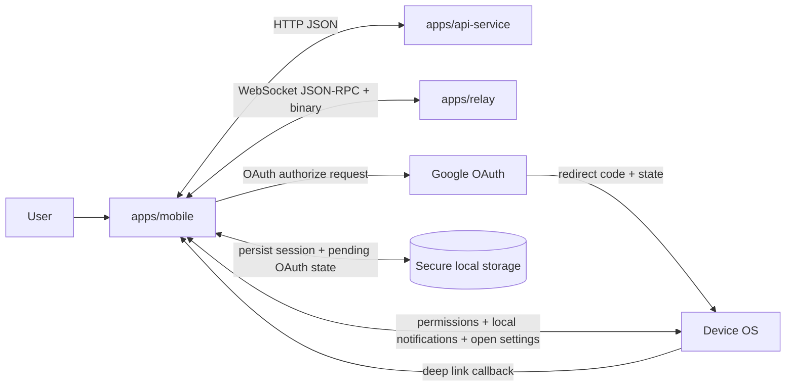
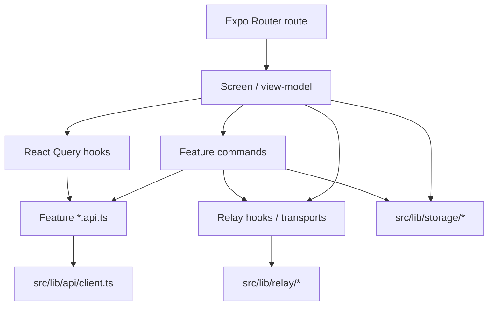
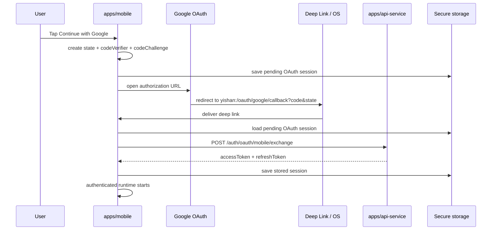
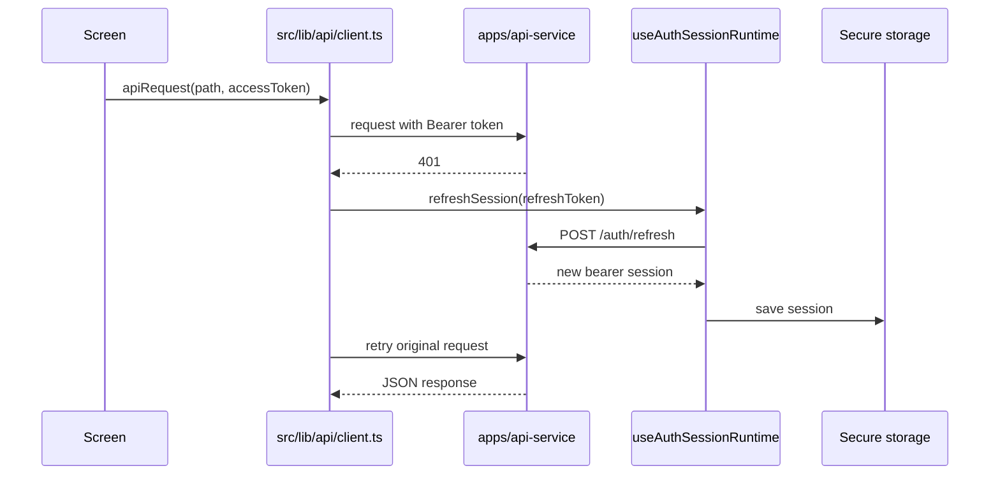
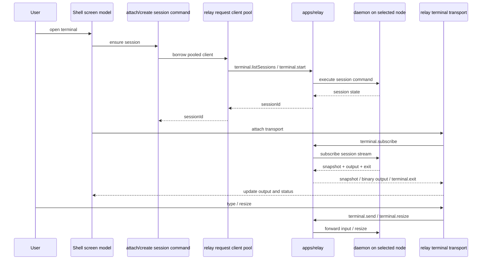
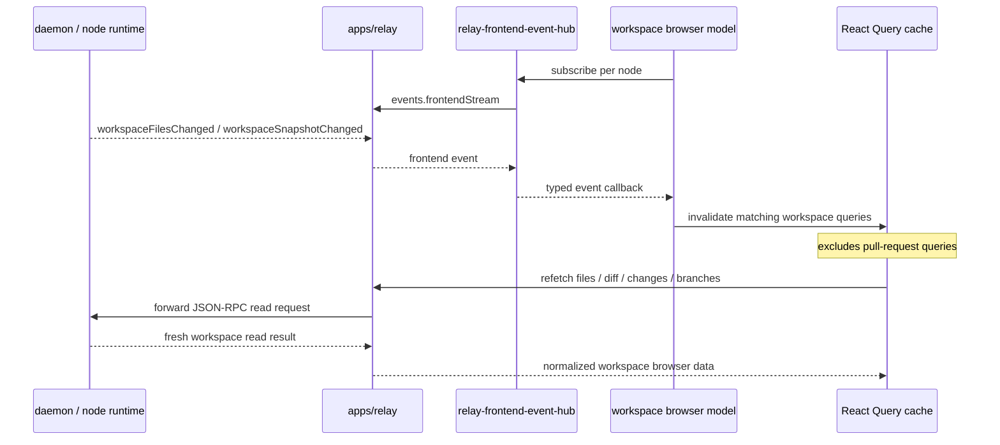
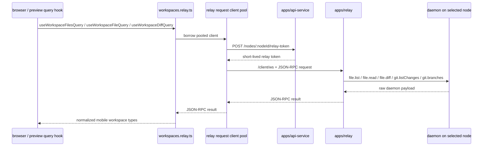
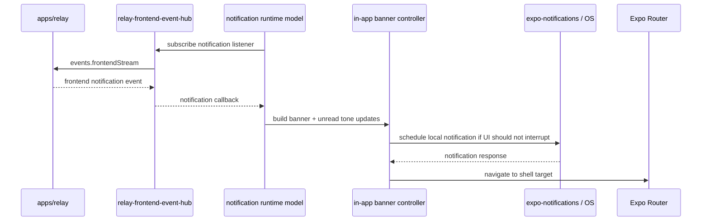
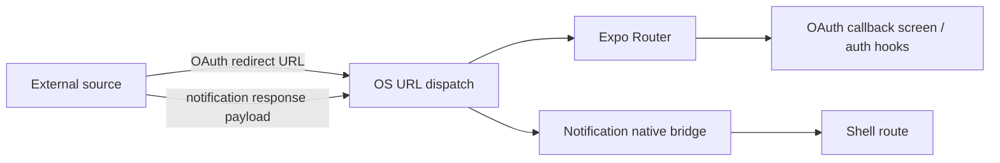

# Mobile Architecture

Last updated: 2026-06-26

## Scope

This document describes the current implementation architecture of `apps/mobile`.

It focuses on two things:

- the internal ownership model inside the mobile app
- every external communication boundary the app currently uses

This is an implementation-state document, not a future-state wish list.

## Runtime shape

`apps/mobile` is an Expo Router app with feature-owned logic.

- `app/` owns route composition and auth/app route groups
- `src/providers/` owns global provider wiring
- `src/features/*` owns screen models, commands, API wrappers, query hooks, and feature-local domain logic
- `src/lib/api` owns shared HTTP behavior, auth refresh retry, and error handling
- `src/lib/relay` owns direct relay WebSocket transport and JSON-RPC framing
- `src/lib/storage` owns secure local persistence for auth and UI runtime state

The authenticated runtime is shell-first:

- sign-in flow enters through `(public)`
- authenticated features run inside `(app)`
- shell is the main runtime surface
- settings and profile are utility surfaces around the same authenticated session

## External communication summary

| Boundary | Transport | Current owner in mobile | Purpose |
| --- | --- | --- | --- |
| `apps/api-service` | HTTP JSON | `src/lib/api/client.ts` + feature `*.api.ts` | auth, me, org/project/node/workspace registry CRUD, pull request read-side |
| `apps/relay` | WebSocket JSON-RPC + binary frames | `src/lib/relay/*` + workspace/shell relay adapters | terminal runtime, workspace file browser reads, frontend event fan-out |
| Google OAuth | browser redirect + deep link callback | `src/features/auth/oauth/*` | initial identity sign-in |
| OS deep links | Expo Linking | auth + notification navigation | OAuth callback and notification re-entry |
| OS notifications | `expo-notifications` | `src/features/notifications/hooks/*` | permission checks, local notification presentation, tap handling |
| Secure device storage | SecureStore/localStorage adapter | `src/lib/storage/*` | persisted bearer session and pending OAuth request |

## System context

## Internal ownership

The main ownership rule is:

- views and screens render
- commands orchestrate
- query hooks own server state
- `lib/api` and `lib/relay` own transport details

## Communication surfaces

### 1. HTTP to `apps/api-service`

`src/lib/api/client.ts` is the shared HTTP entry point.

It owns:

- base URL resolution from `EXPO_PUBLIC_API_BASE_URL`
- bearer token injection
- one automatic refresh attempt on `401`
- timeout handling
- error decoding into `ApiError`

Feature modules then layer typed transport functions on top.

Current API groups:

| Feature | Endpoints used by mobile |
| --- | --- |
| auth | `POST /auth/oauth/mobile/exchange`, `POST /auth/refresh`, `POST /auth/revoke` |
| me | `GET /me`, `PUT /language-preference`, `PUT /notification-preferences` |
| organizations | `GET /orgs`, `POST /orgs` |
| projects | `GET/POST/PUT/DELETE /orgs/:orgId/projects` |
| nodes | `GET /orgs/:orgId/nodes` |
| workspaces | `GET/POST /orgs/:orgId/projects/:projectId/workspaces`, `PATCH /workspaces/close` |
| pull requests | `GET /pull-requests`, `POST /pull-request/refresh` |

## Auth and session lifecycle

Current auth is bearer-session based.

- Google OAuth is the identity entry point
- mobile exchanges the Google auth code with `apps/api-service`
- API returns Yishan bearer session tokens
- mobile persists `accessToken` and `refreshToken` locally
- later API requests auto-refresh on `401`

Important current constraints:

- iOS browser-based Google OAuth is wired
- Android browser-based Google OAuth is explicitly not wired yet
- mobile stores the pending OAuth request locally before leaving the app

### Session refresh path

## Direct relay communication

Relay is now the primary runtime path for interactive node-bound behavior, but
mobile does not send its API bearer token directly to `/client/ws`.

The auth boundary is split like this:

- `apps/api-service` remains the root session authority
- mobile exchanges the current bearer session for a short-lived node-scoped
  relay token through `POST /nodes/:nodeId/relay-token`
- `src/lib/relay/relay-stream-client.ts` opens `/client/ws` with that relay
  token
- relay validates both the token type and the requested `nodeId`

`src/lib/relay/relay-stream-client.ts` is the shared wire protocol client. It
supports:

- JSON-RPC request/response
- frontend event push delivery
- binary terminal output frames
- terminal exit events

The current mobile relay support code is split across:

- `src/lib/relay/relay-node-token.ts` for short-lived node relay-token fetch and
  cache
- `src/lib/relay/relay-request-client-pool.ts` for pooled request/response
  sockets keyed by `nodeId + accessToken`
- `src/lib/relay/relay-frontend-event-hub.ts` for one shared frontend-event
  stream per `nodeId + accessToken`
- `src/lib/relay/relay-stream-client.ts` for the underlying WebSocket transport
  and JSON-RPC framing

Current active relay methods used by mobile:

| Method / event | Used for |
| --- | --- |
| `events.frontendStream` | subscribe to per-node frontend events |
| `file.list` | workspace file tree and expanded directory reads |
| `file.read` | file preview / file tab content |
| `file.diff` | diff preview / changes diff content |
| `git.listChanges` | changes tab sections |
| `git.branches` | source-branch selector and branch metadata reads |
| `terminal.listSessions` | list terminal sessions for one workspace |
| `terminal.start` | create terminal session |
| `terminal.stop` | stop terminal session |
| `terminal.subscribe` | attach to terminal stream and receive snapshot |
| `terminal.send` | send terminal input |
| `terminal.resize` | resize terminal |
| `terminal.exit` | async exit event |

### Relay terminal runtime

Current terminal runtime ownership is split:

- terminal list/start/stop request/response goes through pooled relay RPC
- terminal subscribe/send/resize/output uses a dedicated live session stream
- shell state remains local in mobile

### Frontend events and cache invalidation

Relay is also the event fan-out path for workspace-level freshness.

Current mobile uses frontend events for:

- terminal lifecycle reconciliation
- workspace browser live query invalidation
- notification runtime events

The important architectural split is:

- workspace browser reads come from relay
- pull request reads still come from API
- freshness is pushed from relay
- relay freshness invalidation only covers relay-backed workspace read queries

## Relay-backed workspace browser reads

The workspace browser no longer goes through `apps/api-service` for file-system and git-read paths.

Mobile now reuses pooled relay request clients through:

- `src/features/workspaces/workspaces.relay.ts`
- `src/lib/relay/relay-request-client-pool.ts`
- `src/lib/relay/relay-stream-client.ts`

Each pooled client is keyed by `nodeId + accessToken`, exchanges the API bearer
session for a node-scoped relay token before connect, and closes after an idle
window. Those adapters normalize daemon JSON-RPC payloads into the same mobile
types the old API path exposed, so the query/view layers did not need a model
rewrite.

## Notifications and OS bridge

Notifications are not backed by Expo push-token registration in the current code.

What exists today:

- permission read/request through `expo-notifications`
- local notification scheduling when relay frontend events should surface outside the current UI focus
- notification tap handling back into shell navigation

What does not exist today:

- backend registration of Expo push tokens
- remote APNs/FCM delivery pipeline owned by mobile

## Deep links and native re-entry

There are two active deep-link use cases.

1. OAuth callback
2. Notification tap re-entry

The mobile app does not currently use deep links as a long-lived token transport.

## Local persistence boundary

Local persistence is outside the network boundary but still part of the app's external I/O surface.

Persisted items that matter for communication:

- stored bearer session
- pending Google OAuth request
- shell state snapshots
- theme/language preferences

The important rule is:

- refresh tokens are persisted through the secure storage adapter, not raw route or screen state

## Current source-of-truth split

This is the current contract, not the eventual ideal.

### API remains the source of truth for

- bearer session issue/refresh/revoke
- current user profile and preferences
- organizations, projects, nodes
- workspace registry CRUD and list
- pull request list and pull-request refresh

### Relay is now the source of truth for

- workspace file tree reads
- file content reads
- diff reads
- git changes
- git branches
- terminal interactive runtime
- terminal session list/start/stop in the active shell path
- terminal output streaming
- frontend event fan-out
- workspace freshness signals
- notification event stream

### Device OS / platform APIs are the source of truth for

- notification permission state
- deep-link delivery
- notification response callbacks
- opening system settings

## Migration status

### Already migrated to relay

- workspace file tree reads
- file content reads
- diff reads
- git changes
- git branches
- terminal session lifecycle in shell
- terminal output stream
- frontend events stream
- workspace browser freshness invalidation
- notification event stream

### Still on API

- pull request list and refresh
- project, workspace, org, node CRUD/list endpoints

### Needs new backend capability before mobile can leave API completely

- auth bootstrap, bearer refresh, and node-scoped relay token issue still require
  API-issued session tokens before relay can be used
- project and node list over relay would currently depend on node-local persisted auth, which is a different contract from mobile bearer auth
- pull request history still lacks a relay-native history surface equivalent to the existing API tab data
- workspace registry create/list/close is still backend-coordinated state, not just local daemon state

## Current communication matrix

| Mobile capability | Current backend | Why |
| --- | --- | --- |
| sign in / refresh / revoke | API | relay still depends on an API-issued bearer session and node-scoped relay-token exchange |
| me + preferences | API | account-level backend state |
| organizations | API | control-plane list/create |
| projects | API | control-plane CRUD plus `withWorkspaces` contract |
| nodes | API | org-scoped availability and capability list |
| workspaces list/create/close | API | registry + backend coordination |
| files / file / diff / changes / branches | Relay | node-local workspace reads run over pooled relay clients after node-scoped relay-token exchange |
| terminal list/start/stop | Relay | node-bound control requests reuse pooled relay clients |
| terminal subscribe/send/resize/stream | Relay | live terminal runtime stays on a dedicated session stream |
| frontend events / notifications | Relay | one shared per-node frontend-event stream fans out to multiple mobile consumers |
| pull request list / refresh | API | still no equivalent relay history surface |

## Practical reading order

If you need to trace a bug quickly, start here:

1. auth/session: `src/providers/AuthProvider.tsx`, `src/features/auth/hooks/useAuthSessionRuntime.ts`, `src/features/auth/hooks/useAuthSignInFlows.ts`
2. HTTP boundary: `src/lib/api/client.ts` and feature `*.api.ts`
3. relay boundary: `src/lib/relay/relay-node-token.ts`, `src/lib/relay/relay-request-client-pool.ts`, `src/lib/relay/relay-frontend-event-hub.ts`, `src/lib/relay/relay-stream-client.ts`
4. terminal runtime: `src/features/shell/terminal/*`
5. notifications: `src/features/notifications/hooks/*`
